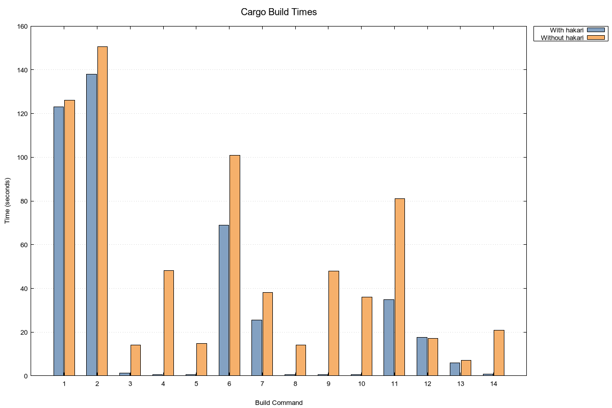
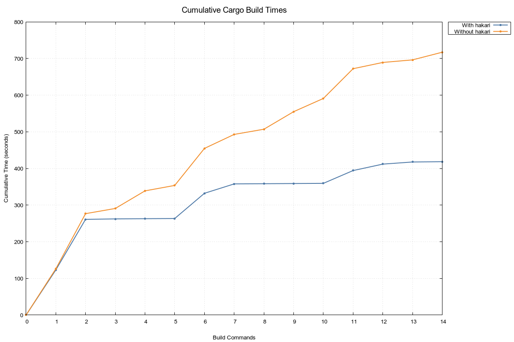

# Performance data for cargo-hakari on omicron

## Introduction

[cargo-hakari](https://docs.rs/cargo-hakari) is a manager for Cargo _workspace-hack packages_. These packages are used to perform feature unification, which can make Cargo builds significantly faster. For more information about cargo-hakari, see [_About cargo-hakari_](https://docs.rs/cargo-hakari/latest/cargo_hakari/about).

[Rust RFC 3692](https://github.com/rust-lang/rfcs/pull/3692) proposes
adding feature unification to Cargo. As part of the case for that, hakari's maintainer
[Rain](https://github.com/sunshowers) has gathered some data to establish the performance benefits
of feature unification.

The data was gathered against the largest repository at [Oxide](https://oxide.computer),
[Omicron](https://github.com/oxidecomputer/omicron). (Oxide is Rain's employer as of October 2024.)

## Benchmark platform

- Operating system: Linux, Pop!\_OS 22.04 running kernel 6.9.3
- Processor: AMD Ryzen 7950x, 16c/32t
- RAM: 64GB DDR5 ECC UDIMM, 5200MT/s
- Filesystem: source file system is btrfs, compiled artifacts are on ext4; both are on separate NVMe
  drives.
- Commit: [`f0b804818b89`](https://github.com/oxidecomputer/omicron/tree/f0b804818b898bebdb317ac2b000618944c02457)
- Rust version: 1.80.1 (pinned via [`rust-toolchain.toml`](https://github.com/oxidecomputer/omicron/blob/f0b804818b898bebdb317ac2b000618944c02457/rust-toolchain.toml))
- Linker: `mold`

## Preparation

```
git clone https://github.com/oxidecomputer/omicron
cd omicron
git checkout f0b804818b898bebdb317ac2b000618944c02457
cargo fetch
cargo xtask download all
```

Three datasets were gathered:

1. **With hakari**: Omicron comes with hakari configured, so no extra work needs to be done.
2. **Hakari without target-host unification**: This is the current proposal in RFC 3692: unify
   features separately for target and host platforms, but don't unify features across both.

   To test this option out, edit `.config/hakari.toml` and add `unify-target-host = "none"` to the
   start of the file.

   A diff with the changes is in [`unify-target-host-none.diff`](unify-target-host-none.diff): removed lines indicate feature sets unified across the target and host, and added lines indicate feature sets unified separately.

   See [`UnifyTargetHost`](https://docs.rs/hakari/0.17.4/hakari/enum.UnifyTargetHost.html) for more
   information.

3. **Without hakari**: To test without hakari, run:

   ```
   cargo install --locked cargo-hakari
   cargo hakari disable
   ```

## Commands run

The following commands were run as part of the test. These were a representative sample of commands Rain ran against Omicron in the last week of September 2024.

Before each series of commands, `cargo clean` was run.

1. `cargo build`
2. `cargo build --all-targets`
3. `cargo build -p omicron-common`
4. `cargo build -p nexus-db-queries`
5. `cargo build -p nexus-types`
6. `cargo build -p nexus-reconfigurator-execution --all-targets`
7. `cargo build -p omicron-sled-agent -p sled-agent-types --all-targets`
8. `cargo build -p nexus-reconfigurator-planning`
9. `cargo build -p reconfigurator-cli`
10. `cargo build -p nexus-auth`
11. `cargo build -p nexus-db-queries --all-targets`
12. `cargo build -p 'nexus-db-*' --all-targets`
13. `cargo build -p '*reconfigurator*' --all-targets`
14. `cargo build -p 'oximeter*'`

## Build times

See [`input_data.txt`](input_data.txt).

- The first column is the command index, above.
- The second column is wall-clock time in seconds with hakari.
- The third column is wall-clock time in seconds with hakari, but without target-host unification.
- The fourth column is wall-clock time in seconds without hakari.

### Charts

Chart of each individual build step, generated by [`plot.gnu`](plot.gnu):



Chart of cumulative build times, generated by [`plot_cumulative.gnu`](plot_cumulative.gnu):



## Build size

The size of `target/debug` after all of the above commands have been run can indicate how many extra builds occurred.

- With hakari, `target/debug` is 55GB after all of the above commands.
- With hakari but without target-host unification, `target/debug` is 59GB.
- Without hakari, `target/debug` is 78GB.

## Summary

The cumulative time spent is:

- **With hakari:** 418 seconds
- **Hakari without target-host unification:** 492 seconds
- **Without hakari**: 717 seconds

With hakari, this is a roughly 1.7x speedup. With hakari but without target-host unification, this is roughly a 1.5x improvement -- still substantial, but less so than the default hakari setup.

Hakari feels even faster than that, though, because a number of the builds with it are no-ops (take
less than a second).

The build size on disk with hakari (with or without target-host unification) sees a roughly 1.4x
improvement. This means less I/O, less wear on the disk, and less of a need to run `cargo clean` --
which also improves build times in the aggegrate.

## License

CC0
