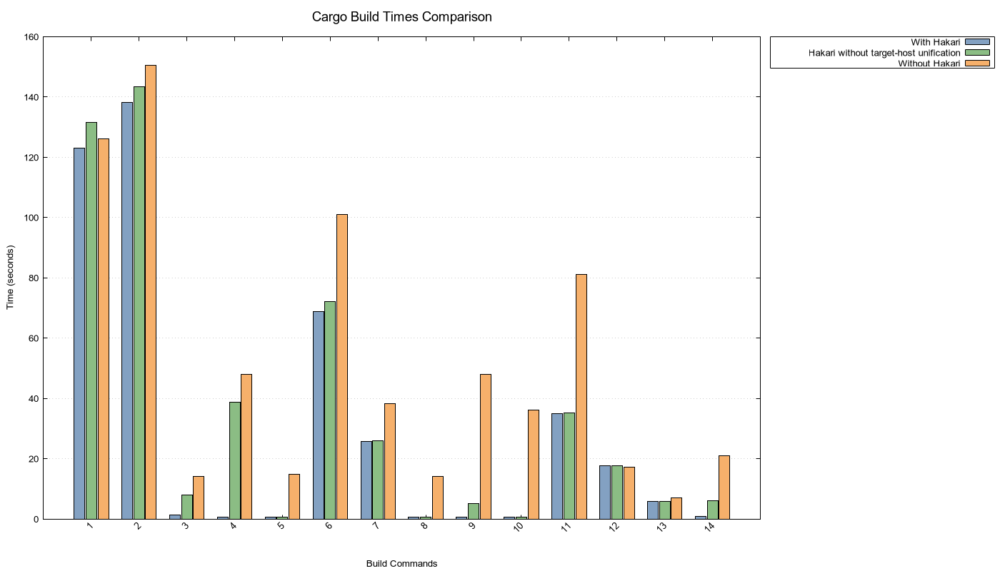
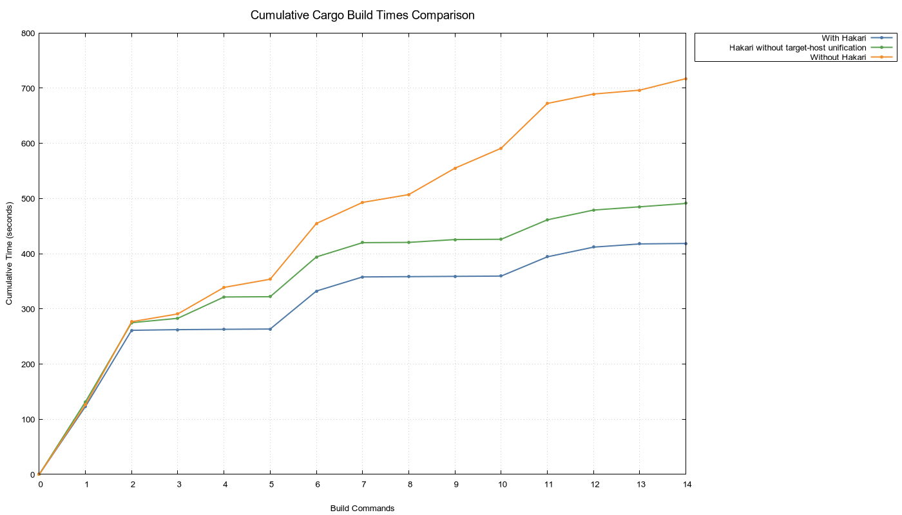

# Performance data for cargo-hakari on omicron

## Benchmark platform

- Operating system: Linux, Pop!\_OS 22.04 running kernel 6.9.3
- Processor: AMD Ryzen 7950x, 16c/32t
- RAM: 64GB DDR5 ECC UDIMM, 5200MT/s
- Filesystem: source file system is btrfs, compiled artifacts are on ext4
- Linker: `mold`

## Preparation

```
git clone https://github.com/oxidecomputer/omicron
cd omicron
git checkout f0b804818b898bebdb317ac2b000618944c02457
cargo xtask download all
```

Omicron comes with hakari configured. To test without hakari, run:

```
cargo install --locked cargo-hakari
cargo hakari disable
```

## Commands run

The following commands were run as part of the test.

1. `cargo build`
2. `cargo build --all-targets`
3. `cargo build -p omicron-common`
4. `cargo build -p nexus-db-queries`
5. `cargo build -p nexus-types`
6. `cargo build -p nexus-reconfigurator-execution --all-targets`
7. `cargo build -p omicron-sled-agent -p sled-agent-types --all-targets`
8. `cargo build -p nexus-reconfigurator-planning`
9. `cargo build -p reconfigurator-cli`
10. `cargo build -p nexus-auth`
11. `cargo build -p nexus-db-queries --all-targets`
12. `cargo build -p 'nexus-db-*' --all-targets`
13. `cargo build -p '*reconfigurator*' --all-targets`
14. `cargo build -p 'oximeter*'`

## Raw times

See [`input_data.txt`](input_data.txt).

- The first column is the command index, above.
- The second column is time in seconds with hakari.
- The third column is time in seconds without hakari.

## Charts

Chart of each individual build step, generated by [`plot.gnu`](plot.gnu):



Chart of cumulative build times, generated by [`plot_cumulative.gnu`](plot_cumulative.gnu):



## License

CC0
